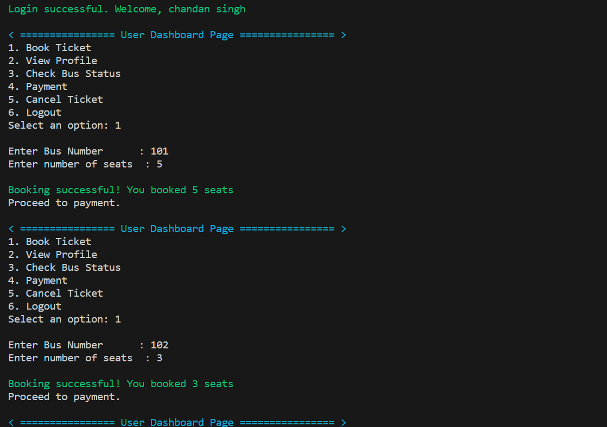
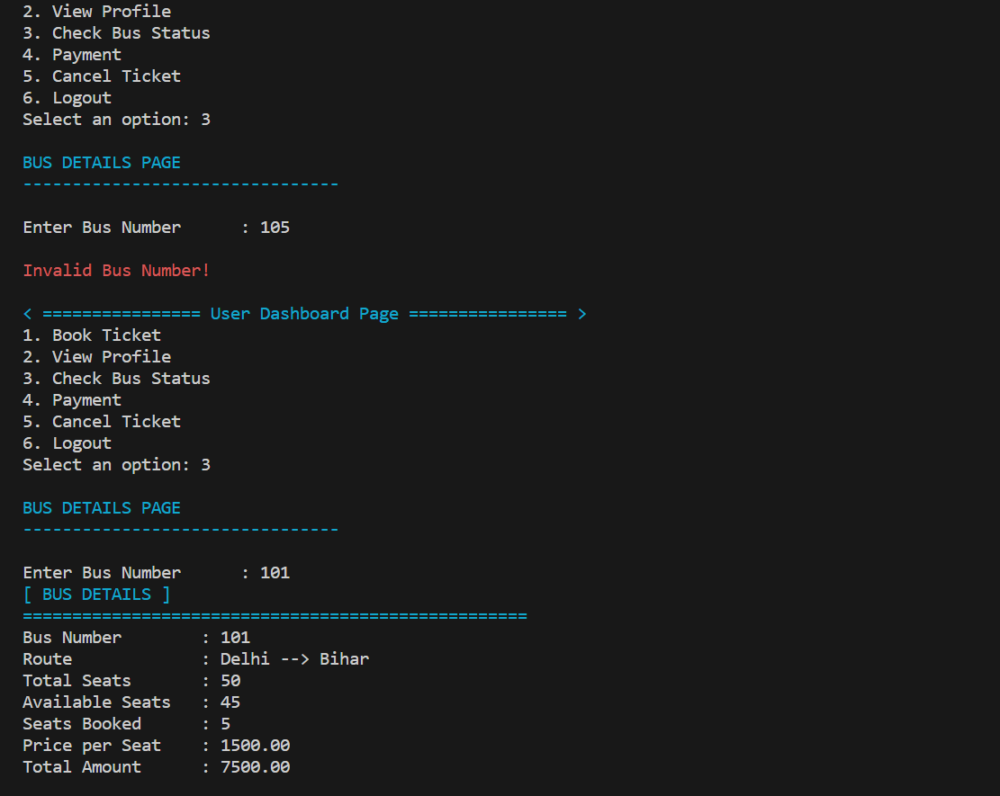
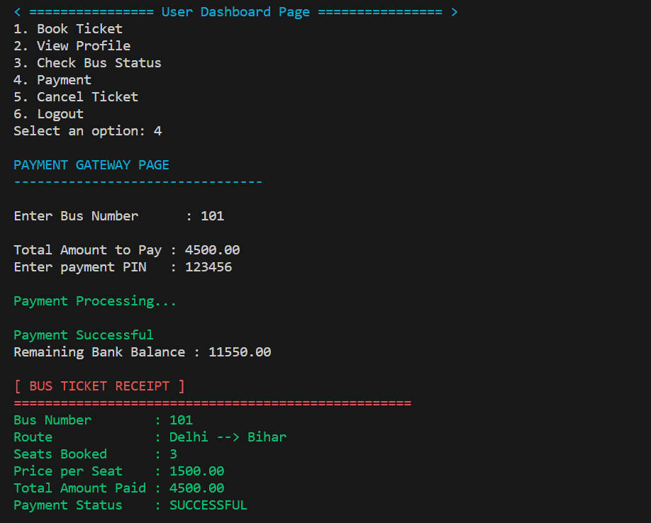
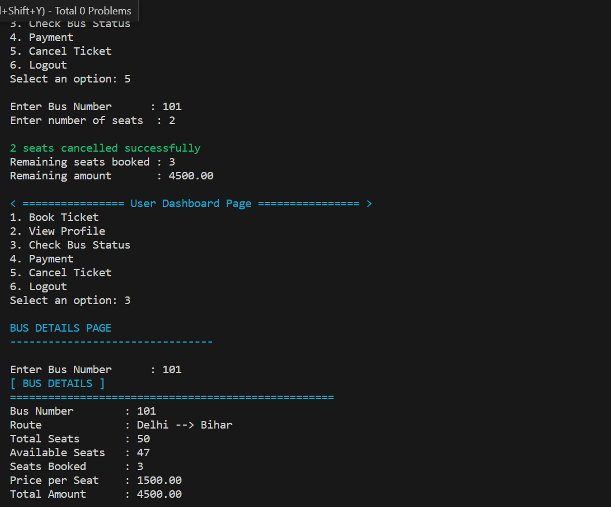
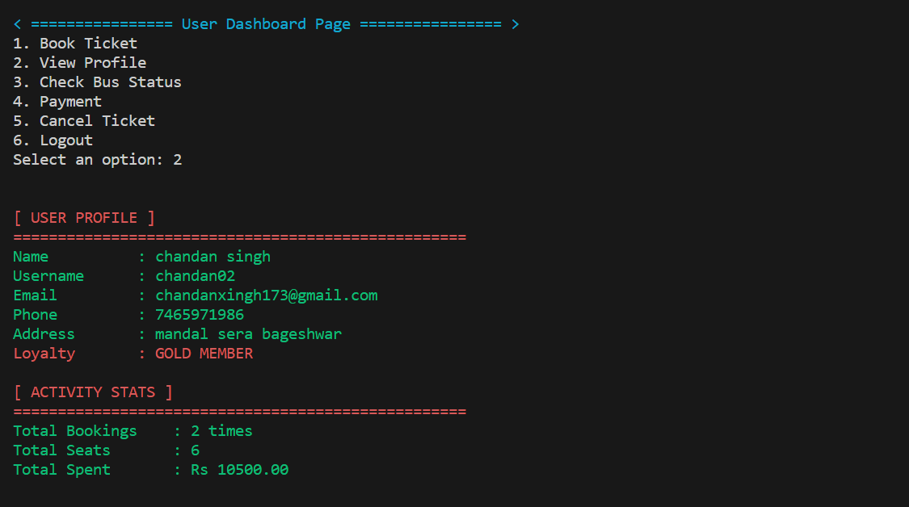
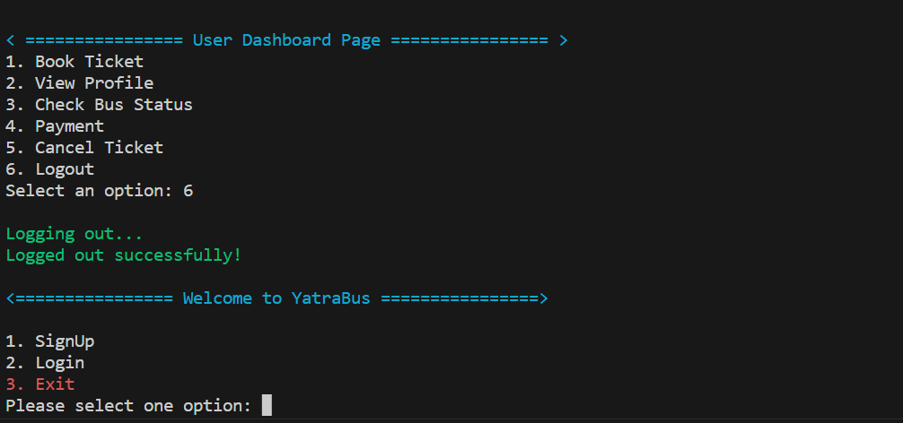

A console-based **Bus Reservation System** developed in **C language**.  

This project allows users to book bus tickets, cancel tickets, check bus status, make payments, and generate receipts through a menu interface.

## 📌 Features

### User signup & login

### Book Ticket

### Check Bus Status

### Payment (Step 1)

### Ticket Cancelled

### Dashboard

### Logout

